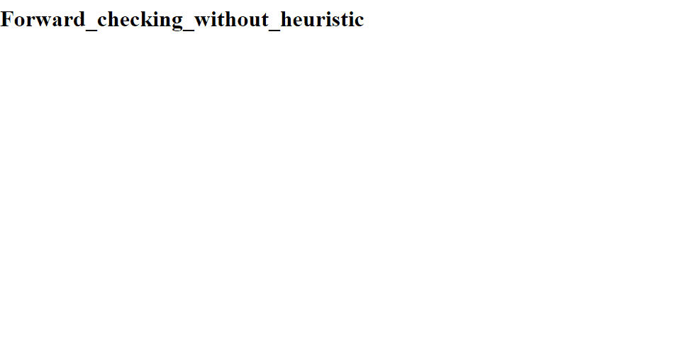

# Map Coloring Problem - using DFS
 
Map Colouring problem is to assign a colour to each region in the map in such a way that two adjacent regions have the same colour.

The solution to the map colouring of Australia and USA maps is achieved by using following techniques 1. depth first search 2. Depth first search using forward checking 3. Depth first search with forward checking and propagation through singleton domain.

There are two ways of using this alogorithms 1. With Heuristics 2. Without Heuristics

Six python files are created for each country.

